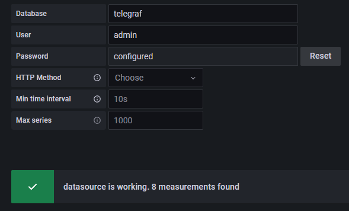

# Grafana+InfluxDB+Chronograf

``` bash
yum update -y && yum upgrade -y && yum install nano -y
```

Install [InfluxDB](https://docs.influxdata.com/influxdb/v1.7/introduction/installation/)

```bash
cat <<EOF | sudo tee /etc/yum.repos.d/influxdb.repo
[influxdb]
name = InfluxDB Repository - RHEL \\$releasever
baseurl = <https://repos.influxdata.com/rhel/\\$releasever/\\$basearch/stable>
enabled = 1
gpgcheck = 1
gpgkey = <https://repos.influxdata.com/influxdb.key>
EOF
yum install influxdb
systemctl start influxdb
systemctl enable influxdb
systemctl status influxdb
```

**Install [Grafana](https://grafana.com/docs/grafana/v9.0/setup-grafana/installation/rpm/)**

```bash
wget <https://dl.grafana.com/enterprise/release/grafana-enterprise-9.2.6-1.x86_64.rpm>
yum install grafana-enterprise-9.2.6-1.x86_64.rpm
systemctl daemon-reload
systemctl status grafana-server
systemctl start grafana-server
systemctl enable grafana-server
firewall-cmd --list-ports
firewall-cmd --add-port=3000/tcp --permanent && firewall-cmd --add-port=8086/tcp --permanent
firewall-cmd --reload
```

**Install [Telegraf](https://portal.influxdata.com/downloads/)**

```bash
# influxdb.key GPG Fingerprint: 05CE15085FC09D18E99EFB22684A14CF2582E0C5
cat <<EOF | sudo tee /etc/yum.repos.d/influxdata.repo
[influxdata]
name = InfluxData Repository - Stable
baseurl = <https://repos.influxdata.com/stable/\\$basearch/main>
enabled = 1
gpgcheck = 1
gpgkey = <https://repos.influxdata.com/influxdb.key>
EOF
sudo yum install telegraf
systemctl start telegraf
systemctl enable telegraf
systemctl status telegraf
```

InfluxDB initial config

```bash
influx
CREATE USER "admin" WITH PASSWORD '050506' WITH ALL PRIVILEGES
exit
nano /etc/influxdb/influxdb.conf
auth-enabled = true
Ctrl+X yes
```

Add source database


